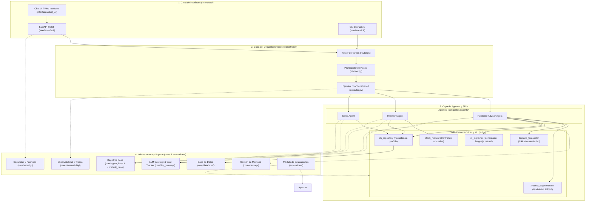

# 🏛️ Arquitectura del Sistema - Tienda Religiosa MilanFramework

Arquitectura modular en **cuatro capas** orientada a agentes inteligentes, skills determinísticas, machine learning y evaluaciones continuas aplicadas al comercio minorista de artículos religiosos.

---

## 🏗️ Detalle de las Cuatro Capas

### 1. Capa de Interfaces (`interfaces/`)
Puntos de entrada y consumo de los servicios del framework:
- **`api/`**: Servidor REST construido con **FastAPI**. Define rutas modulares (`routes_auth`, `routes_products`, `routes_sales`, `routes_inventory`, `routes_festivities`, `routes_recommendations`, `routes_dashboard`) con inyección de dependencias para seguridad.
- **`cli/`**: Consola interactiva por línea de comandos para administración, simulaciones y ejecuciones rápidas del sistema.
- **`chat_ui/`**: Componente de interfaz visual para interacción directa y asistida.

### 2. Capa del Orquestador (`core/orchestrator/`)
Gestión y flujo centralizado de ejecución de tareas del framework:
- **`router.py`**: Enruta el `intent` de cada solicitud al agente correspondiente registrado en `AGENT_REGISTRY`.
- **`planner.py`**: Construye el plan de ejecución descomponiendo tareas complejas en pasos secuenciales de skills.
- **`executor.py`**: Ejecuta los agentes y planes capturando excepciones y emitiendo eventos al sistema de trazabilidad.

### 3. Capa de Agentes y Skills (`agents/` y `skills/`)
- **Agentes Inteligentes (`agents/`)**:
  - `purchase_advisor_agent`: Analiza inventario, historial de ventas y festividades religiosas para sugerir abastecimiento optimizado.
  - `inventory_agent`: Monitorea stock, detecta productos agotados o en riesgo de quiebre y emite alertas.
  - `sales_agent`: Procesa transacciones, consolidación de ventas diarias y cálculo de productos con mayor movimiento.
- **Skills de Negocio y Machine Learning (`skills/`)**:
  - `product_segmentation`: Algoritmo de agrupamiento ML basado en Recencia, Frecuencia, Varianza y afinidad festiva (RF11).
  - `demand_forecaster`: Cálculo cuantitativo de reorden con multiplicadores de demanda por festividad (RF12).
  - `nl_explainer`: Formateador de justificaciones comprensibles en lenguaje cotidiano (RF13).
  - `stock_monitor`: Evaluador determinístico de niveles mínimos y críticos de inventario (RF09).
  - `db_repository`: Abstracción de persistencia relacional con transacciones atómicas (RNF05) y auditoría de movimientos (RNF08).

### 4. Infraestructura y Componentes Transversales (`core/` & `evaluations/`)
- **`core/database/`**: Modelos SQLAlchemy (`User`, `Product`, `Sale`, `SaleItem`, `InventoryMovement`, `Festivity`), conexión SQLite y siembra de datos (`seed_data.py`).
- **`core/security/`**: Autenticación JWT, hashing PBKDF2-HMAC-SHA256, matriz de permisos RBAC (`permissions.py`) y guardrails de validación (`guardrails.py`).
- **`core/memory/`**: Memoria de corto plazo (sesión volátil) y largo plazo (insights acumulados) integrada a través de `MemoryManager`.
- **`core/observability/`**: Registro estructurado de trazas (`Tracer`) y logger unificado (`logger.py`).
- **`core/llm_gateway/`**: Enrutador de proveedores LLM / heurísticas (`provider_router.py`) y control de consumo de tokens (`cost_tracker.py`).
- **`core/agent_base/` & `core/skill_base/`**: Clases base y registros globales (`AGENT_REGISTRY` y `SKILL_REGISTRY`).
- **`evaluations/`**: Suite de pruebas y benchmarks automatizados (`run_tests.py`, `agent_benchmarks/`, `skill_tests/`) para verificar el rendimiento de agentes y habilidades.

