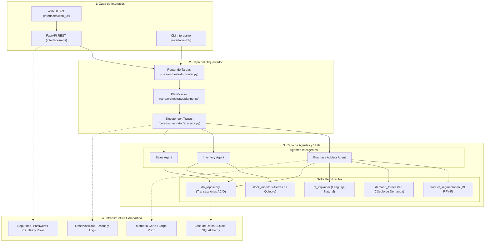

# 🏛️ Arquitectura del Sistema - Tienda Religiosa MilanFramework

Arquitectura modular en **cuatro capas** orientada a agentes inteligentes, skills determinísticas y machine learning aplicado al comercio minorista de artículos religiosos.

---

## 🏗️ Detalle de las Cuatro Capas

### 1. Capa de Interfaces (`interfaces/`)
Puntos de entrada e interacción con los usuarios:
- **`web_ui/`**: Interfaz de usuario intuitiva pensada para personas sin formación técnica (RNF01). Permite operar caja, ver inventario, registrar festividades y consultar recomendaciones con explicaciones en lenguaje cotidiano.
- **`api/`**: Servidor REST con **FastAPI**. Implementa control de acceso basado en roles (`ADMIN` y `VENDEDOR`) mediante JWT.
- **`cli/`**: Consola interactiva para administración, pruebas rápidas y simulaciones.

### 2. Capa del Orquestador (`core/orchestrator/`)
Coordina la toma de decisiones y la delegación de tareas:
- **`router.py`**: Identifica el `intent` de la solicitud y resuelve qué agente debe atenderlo.
- **`planner.py`**: Descompone tareas complejas (ej. asesoría de compras) en secuencias ordenadas de ejecución de skills.
- **`executor.py`**: Ejecuta el plan de forma controlada, capturando excepciones y emitiendo trazas de observabilidad.

### 3. Capa de Agentes y Skills (`agents/` y `skills/`)
- **Agentes (Deciden)**:
  - `purchase_advisor_agent`: Analiza el inventario disponible, el historial de ventas y las festividades católicas para aconsejar compras al administrador.
  - `inventory_agent`: Audita el catálogo, detecta quiebres y clasifica productos en riesgo.
  - `sales_agent`: Consolida el cierre diario, cálculo de ingresos y productos estrella.
- **Skills (Ejecutan determinísticamente)**:
  - `product_segmentation`: Modelo ML de agrupamiento según Recencia, Frecuencia, Varianza y afinidad con Festividades (RF11).
  - `demand_forecaster`: Algoritmo cuantitativo que proyecta la demanda para un horizonte de 15/30 días considerando multiplicadores festivos (RF12).
  - `nl_explainer`: Transforma datos numéricos en justificaciones sencillas y claras para el tendero (RF13).
  - `stock_monitor`: Evaluador de umbrales de stock mínimo y productos agotados (RF09).
  - `db_repository`: Acceso a datos con transaccionalidad atómica (RNF05) y registro auditable de movimientos (RNF08).

### 4. Capa de Infraestructura Compartida (`core/`)
- **`core/database/`**: Modelado relacional (`Product`, `Sale`, `SaleItem`, `InventoryMovement`, `Festivity`, `User`).
- **`core/security/`**: Hashing de contraseñas con PBKDF2-HMAC-SHA256 (RNF03), matriz RBAC (RNF04) y guardrails de negocio (precios positivos, stock no negativo).
- **`core/memory/`**: Memoria de corto plazo (sesión) y largo plazo (insights y resúmenes).
- **`core/observability/`**: Tracer de eventos y logger centralizado.
