# Modelado de Datos y Clases — MilanFramework

Capa de persistencia sobre **PostgreSQL** y estructura de datos para memoria, seguridad,
sesiones, observabilidad y control de costos. Derivado de `core/database/`,
`core/memory/`, `core/security/`, `core/observability/`, `core/llm_gateway/` y los
requerimientos de `docs/product/requirements.md`.

## 1. Diagrama Entidad-Relaciones (DER)

```mermaid
erDiagram

    ROLES {
        int id PK
        string name UK "ADMIN, VENDEDOR"
        string description
        boolean is_active
    }

    USERS {
        uuid id PK
        int role_id FK
        string username UK
        string email UK
        string password_hash "PBKDF2-HMAC-SHA256, RNF03"
        string full_name
        boolean is_active
        datetime last_login_at
        datetime created_at
    }

    SESSIONS {
        uuid id PK
        uuid user_id FK
        string refresh_token_hash
        string ip_address
        string user_agent
        boolean is_revoked
        datetime expires_at
        datetime created_at
    }

    CHAT_SESSIONS {
        uuid id PK
        uuid user_id FK
        string title
        string channel "chat_ui, cli, api"
        string context_summary "resumen volatil"
        int message_count
        datetime started_at
        datetime last_activity_at
        datetime ended_at
    }

    CHAT_MESSAGES {
        uuid id PK
        uuid chat_session_id FK
        string role "user, assistant, system, tool"
        text content
        jsonb tool_calls "skills invocadas"
        int prompt_tokens
        int completion_tokens
        datetime created_at
    }

    CATEGORIES {
        int id PK
        string name UK
        string description
        boolean is_active
    }

    PRODUCTS {
        int id PK
        int category_id FK
        string code UK
        string name
        string description
        numeric price "no negativo"
        int stock_actual "columna leida por stock_monitor.py"
        int stock_minimo "columna leida por stock_monitor.py"
        boolean is_active "filtro active_only"
        datetime created_at
        datetime updated_at
    }

    INVENTORY_MOVEMENTS {
        bigint id PK
        int product_id FK
        int sale_id FK
        int user_id FK
        string movement_type "ENTRADA, SALIDA, AJUSTE"
        int quantity
        int stock_before
        int stock_after
        string reason "RNF08 auditoria"
        datetime created_at
    }

    INVENTORY_ALERTS {
        bigint id PK
        int product_id FK
        int trace_id FK
        string alert_type "AGOTADO, STOCK_BAJO"
        string severity "CRITICA, ALTA"
        string message
        string status "OPEN, ACK, RESOLVED"
        int acknowledged_by FK
        datetime detected_at
        datetime resolved_at
    }

    SALES {
        int id PK
        uuid user_id FK
        string document_number UK
        decimal total_amount
        int transaction_count "derivado RF08"
        string payment_method
        datetime sold_at
        datetime created_at
    }

    SALE_ITEMS {
        bigint id PK
        int sale_id FK
        int product_id FK
        int quantity
        decimal unit_price
        decimal subtotal
    }

    FESTIVITIES {
        int id PK
        string name "consumido por purchase_advisor"
        string description
        date start_date
        date end_date
        numeric demand_factor "multiplicador RF10"
        boolean is_active
    }

    FESTIVITY_PRODUCTS {
        int festivity_id PK,FK
        int product_id PK,FK
        numeric demand_factor "factor por producto"
    }

    AGENTS {
        int id PK
        string name UK "purchase_advisor_agent"
        string version "manifest.yaml"
        string manifest_path
        boolean is_active "config/agents.yaml"
        jsonb required_skills
        jsonb permissions
    }

    SKILLS {
        int id PK
        string name UK "db_repository"
        string version "manifest.yaml"
        string manifest_path
        boolean is_active "config/skills.yaml"
        jsonb permissions
    }

    ML_MODELS {
        int id PK
        string name "product_segmentation"
        string algorithm "KMeans, RFV-F"
        string version
        boolean is_active "RNF06 reentrenamiento"
        jsonb hyperparameters "n_clusters, window_days"
        datetime trained_at
    }

    MODEL_TRAINING_RUNS {
        bigint id PK
        int ml_model_id FK
        uuid triggered_by FK "RF14 solo admin"
        string status "PENDING, RUNNING, SUCCESS, FAILED"
        int sample_size
        jsonb metrics "silhouette, inertia"
        text log
        datetime started_at
        datetime finished_at
    }

    PRODUCT_SEGMENTS {
        bigint id PK
        int ml_model_id FK
        int product_id FK
        int segment_label
        string segment_name
        numeric recency "RF11"
        numeric frequency "RF11"
        numeric variance "RF11"
        numeric festivity_affinity "RF11"
        datetime computed_at
    }

    PURCHASE_RECOMMENDATIONS {
        bigint id PK
        int product_id FK
        int festivity_id FK
        uuid requested_by FK "RF14 solo admin"
        int suggested_quantity
        numeric estimated_cost
        string priority "URGENTE, ALTA, MEDIA"
        text natural_language_reason "RF13 via nl_explainer"
        jsonb raw_forecast "salida de demand_forecaster"
        string status "NEW, APPROVED, REJECTED"
        datetime created_at
    }

    MEMORY_ENTRIES {
        bigint id PK
        uuid user_id FK
        uuid chat_session_id FK
        int agent_id FK
        string memory_scope "SHORT_TERM, LONG_TERM"
        string memory_key "sales_summary_2026-01-15"
        jsonb content "payload de memory_manager.remember"
        float importance_score
        int access_count
        datetime expires_at "TTL solo SHORT_TERM"
        datetime created_at
    }

    TRACES {
        uuid id PK
        uuid parent_trace_id FK "anidamiento de spans"
        uuid chat_session_id FK
        uuid user_id FK
        int agent_id FK
        int skill_id FK
        string traceable_type "ORCHESTRATOR, AGENT, SKILL, LLM"
        string operation "router, planner, run"
        string status "OK, ERROR, FALLBACK"
        jsonb input_payload
        jsonb output_payload
        text error_trace
        int duration_ms
        datetime started_at
        datetime finished_at
    }

    LLM_CALLS {
        bigint id PK
        uuid trace_id FK
        int agent_id FK
        uuid chat_session_id FK
        string provider "provider_router"
        string model "local_heuristic"
        int prompt_tokens
        int completion_tokens
        int total_tokens
        decimal cost_usd
        int latency_ms
        boolean cache_hit
        datetime created_at
    }

    COST_LEDGER {
        bigint id PK
        uuid user_id FK
        int agent_id FK
        date period_date "agregacion diaria"
        int total_calls
        int total_tokens
        decimal total_cost_usd
        decimal budget_limit_usd
        string alert_status "WITHIN, WARNING, EXCEEDED"
    }

    ROLES ||--o{ USERS : "asigna rol"
    USERS ||--o{ SESSIONS : "autentica mediante"
    USERS ||--o{ CHAT_SESSIONS : "inicia"
    CHAT_SESSIONS ||--|{ CHAT_MESSAGES : "contiene"
    USERS ||--o{ SALES : "registra venta"
    USERS ||--o{ INVENTORY_MOVEMENTS : "ejecuta movimiento"
    USERS ||--o{ MODEL_TRAINING_RUNS : "dispara reentrenamiento"
    USERS ||--o{ PURCHASE_RECOMMENDATIONS : "solicita"
    USERS ||--o{ TRACES : "origina"
    USERS ||--o{ COST_LEDGER : "consume"
    USERS ||--o{ MEMORY_ENTRIES : "posee"

    CATEGORIES ||--o{ PRODUCTS : "clasifica"
    PRODUCTS ||--o{ SALE_ITEMS : "vendido en"
    PRODUCTS ||--o{ INVENTORY_MOVEMENTS : "genera"
    PRODUCTS ||--o{ INVENTORY_ALERTS : "produce"
    PRODUCTS ||--o{ PRODUCT_SEGMENTS : "clasificado en"
    PRODUCTS ||--o{ FESTIVITY_PRODUCTS : "asociado a"
    PRODUCTS ||--o{ PURCHASE_RECOMMENDATIONS : "recomendado"

    SALES ||--|{ SALE_ITEMS : "contiene minimo uno"
    SALES ||--o{ INVENTORY_MOVEMENTS : "descuenta stock atomico RNF05"
    INVENTORY_ALERTS }o--|| TRACES : "detectada por"

    FESTIVITIES ||--o{ FESTIVITY_PRODUCTS : "incluye"
    FESTIVITIES ||--o{ PURCHASE_RECOMMENDATIONS : "motiva"
    FESTIVITY_PRODUCTS }o--|| PRODUCTS : "referencia"

    AGENTS ||--o{ TRACES : "ejecuta"
    AGENTS ||--o{ MEMORY_ENTRIES : "escribe"
    AGENTS ||--o{ LLM_CALLS : "consume"
    AGENTS ||--o{ COST_LEDGER : "agregado en"
    AGENTS }o--o{ SKILLS : "declara skills_required"
    SKILLS ||--o{ TRACES : "invocada en"

    ML_MODELS ||--o{ MODEL_TRAINING_RUNS : "se entrena con"
    ML_MODELS ||--o{ PRODUCT_SEGMENTS : "produce"

    CHAT_SESSIONS ||--o{ MEMORY_ENTRIES : "contexto de"
    CHAT_SESSIONS ||--o{ TRACES : "agrupa"
    CHAT_SESSIONS ||--o{ LLM_CALLS : "consume"
    TRACES ||--o{ LLM_CALLS : "detalla costo de"
    TRACES ||--o{ TRACES : "contiene subspan"
```

## 2. Diagrama de Clases del Core

```mermaid
classDiagram
    direction TB

    class BaseAgent {
        <<abstract>>
        +str name
        +run(task) Dict
    }

    class BaseSkill {
        <<abstract>>
        +str name
        +run(params) Dict
    }

    class AgentRegistry {
        <<singleton>>
        +dict AGENT_REGISTRY
        +register_agent(agent_cls)
        +get_agent(name) BaseAgent
        +list_active() List
    }

    class SkillRegistry {
        <<singleton>>
        +dict SKILL_REGISTRY
        +register_skill(skill_cls)
        +get_skill(name) BaseSkill
        +list_active() List
    }

    class Orchestrator {
        +str environment
        +handle_request(intent) Dict
        +shutdown()
    }

    class Router {
        +route(intent) str
        -dict AGENT_REGISTRY
    }

    class Planner {
        +build_plan(task) List
        +estimate_steps(task) int
    }

    class Executor {
        +int max_retries
        +execute(plan) Dict
        +fallback(plan) Dict
    }

    class MemoryManager {
        +remember(key, value, persistent) int
        +recall(key) Dict
        +recall_recent(scope, limit) List
        +forget(key) bool
        +summarize() Dict
    }

    class ShortTermMemory {
        <<volatile>>
        +int ttl_seconds
        +put(key, value) None
        +get(key) Dict
        +purge_expired() int
    }

    class LongTermMemory {
        +put(key, value, importance) int
        +search(query, top_k) List
        +consolidate() int
    }

    class LLMGateway {
        +generate(prompt, context) Dict
        +complete(task) Dict
    }

    class ProviderRouter {
        +str active_provider
        +route_prompt(prompt) str
        +available_providers() List
    }

    class CostTracker {
        +record_call(tokens_in, tokens_out, model) Decimal
        +get_summary(period) Dict
        +check_budget(limit) str
    }

    class Tracer {
        +uuid start_span(traceable_type, operation) str
        +end_span(trace_id, status) None
        +get_trace(trace_id) Dict
    }

    class LogManager {
        +get_logger(name) Logger
        +set_level(level) None
    }

    class DatabaseManager {
        +str engine_url
        +get_session() Session
        +transaction() UnitOfWork
        +health_check() bool
    }

    class UnitOfWork {
        +commit() None
        +rollback() None
    }

    class AuthService {
        +hash_password(pwd) str
        +verify_password(pwd, hashed) bool
        +create_access_token(user) str
        +decode_token(token) Dict
    }

    class PermissionChecker {
        +dict ROLE_PERMISSIONS
        +check_permission(role, permission) bool
        +is_admin(role) bool
    }

    class Guardrails {
        +validate_product_data(data) Dict
        +validate_sale_items(items) List
    }

    class BusinessValidationError {
        <<exception>>
        +str message
        +str field
    }

    class PurchaseAdvisorAgent {
        +str name
        +int horizon_days
        +int window_days
        +run(task) Dict
    }

    class InventoryAgent {
        +str name
        +run(task) Dict
    }

    class SalesAgent {
        +str name
        +run(task) Dict
    }

    class DbRepositorySkill {
        +str name
        +run(params) Dict
    }

    class ProductSegmentationSkill {
        +str name
        +run(params) Dict
        +retrain() Dict
    }

    class DemandForecasterSkill {
        +str name
        +run(params) Dict
    }

    class NlExplainerSkill {
        +str name
        +run(params) Dict
    }

    class StockMonitorSkill {
        +str name
        +run(params) Dict
    }

    class ProductSegmentationModel {
        +int n_clusters
        +bool is_fitted
        +extract_features(products, sales, festivities, window) DataFrame
        +train_and_segment(df) List
    }

    class MemoryEntry {
        +bigint id
        +uuid user_id
        +uuid chat_session_id
        +int agent_id
        +str memory_scope
        +str memory_key
        +dict content
        +datetime expires_at
    }

    class Trace {
        +uuid id
        +uuid parent_trace_id
        +str traceable_type
        +str operation
        +str status
        +int duration_ms
        +datetime started_at
    }

    class LLMCall {
        +bigint id
        +uuid trace_id
        +str provider
        +str model
        +int prompt_tokens
        +int completion_tokens
        +decimal cost_usd
    }

    class User {
        +uuid id
        +str username
        +str password_hash
        +str role
        +bool is_active
    }

    class Product {
        +int id
        +str code
        +str name
        +decimal price
        +int stock_actual
        +int stock_minimo
        +bool is_active
    }

    class Sale {
        +int id
        +uuid user_id
        +decimal total_amount
        +datetime sold_at
    }

    class SaleItem {
        +bigint id
        +int sale_id
        +int product_id
        +int quantity
        +decimal unit_price
    }

    class InventoryMovement {
        +bigint id
        +int product_id
        +int sale_id
        +str movement_type
        +int quantity
        +int stock_before
        +int stock_after
    }

    class Festivity {
        +int id
        +str name
        +date start_date
        +date end_date
        +decimal demand_factor
    }

    class MovementType {
        <<enumeration>>
        ENTRADA
        SALIDA
        AJUSTE
    }

    class MemoryScope {
        <<enumeration>>
        SHORT_TERM
        LONG_TERM
    }

    class TraceableType {
        <<enumeration>>
        ORCHESTRATOR
        AGENT
        SKILL
        LLM
    }

    BaseAgent <|-- PurchaseAdvisorAgent
    BaseAgent <|-- InventoryAgent
    BaseAgent <|-- SalesAgent

    BaseSkill <|-- DbRepositorySkill
    BaseSkill <|-- ProductSegmentationSkill
    BaseSkill <|-- DemandForecasterSkill
    BaseSkill <|-- NlExplainerSkill
    BaseSkill <|-- StockMonitorSkill

    AgentRegistry ..> BaseAgent : registra
    SkillRegistry ..> BaseSkill : registra

    Orchestrator *-- Router
    Orchestrator *-- Planner
    Orchestrator *-- Executor

    Router ..> AgentRegistry : consulta
    Executor ..> AgentRegistry : instancia agente
    Executor ..> SkillRegistry : instancia skill
    Executor ..> Tracer : emite spans
    Executor ..> Guardrails : valida entradas
    Executor ..> PermissionChecker : verifica rol

    PurchaseAdvisorAgent ..> SkillRegistry : resuelve 4 skills
    PurchaseAdvisorAgent --> MemoryManager : persiste recomendaciones
    PurchaseAdvisorAgent ..> LogManager : logs
    InventoryAgent --> MemoryManager : persiste alertas
    InventoryAgent ..> LogManager : logs
    SalesAgent --> MemoryManager : persiste resumen diario
    SalesAgent ..> LogManager : logs

    PurchaseAdvisorAgent *-- ProductSegmentationModel
    ProductSegmentationSkill *-- ProductSegmentationModel
    DbRepositorySkill *-- DatabaseManager

    MemoryManager *-- ShortTermMemory
    MemoryManager *-- LongTermMemory
    MemoryManager ..> Tracer : traza escrituras

    ShortTermMemory ..> MemoryEntry : persiste
    LongTermMemory ..> MemoryEntry : persiste

    LLMGateway *-- ProviderRouter
    LLMGateway *-- CostTracker

    ProviderRouter ..> Tracer : traza decision
    CostTracker *-- LLMCall : registra
    Tracer ..> Trace : persiste

    DatabaseManager *-- UnitOfWork
    DatabaseManager ..> Product : mapea ORM
    DatabaseManager ..> Sale : mapea ORM
    DatabaseManager ..> SaleItem : mapea ORM
    DatabaseManager ..> InventoryMovement : mapea ORM
    DatabaseManager ..> Festivity : mapea ORM
    DatabaseManager ..> User : mapea ORM

    AuthService ..> User : verifica credenciales
    AuthService ..> PermissionChecker : delega rol
    Guardrails ..> BusinessValidationError : lanza
    Guardrails ..> Product : valida
    Guardrails ..> SaleItem : valida

    MemoryScope ..> MemoryEntry : tipa
    TraceableType ..> Trace : tipa
    MovementType ..> InventoryMovement : tipa

    Sale "1" *-- "1..*" SaleItem
    Product "1" *-- "1..*" SaleItem
    SaleItem "0..1" ..> InventoryMovement : origina
    Festivity "0..*" ..> Product : factor demanda
```

## 3. Entidades nuevas requeridas por la tarea

| Entidad | Proposito | Justificacion en el codigo |
| :--- | :--- | :--- |
| `MEMORY_ENTRIES` | Memoria corto/largo plazo | `memory_manager.remember(key, value, persistent)`; claves reales `last_purchase_recommendations`, `latest_inventory_alerts`, `sales_summary_{date}` |
| `USERS` + `ROLES` + `SESSIONS` | Identidad y RBAC | RF01/RF02; `password_hash` PBKDF2 por RNF03; `token_expire_hours` en environments |
| `CHAT_SESSIONS` + `CHAT_MESSAGES` | Sesiones de chat | `interfaces/chat_ui/` consume el orquestador via API |
| `TRACES` (auto-referencial) | Trazas de observabilidad | `tracer.py`: "Traza cada decision del orquestador y cada llamada a skill/LLM" |
| `LLM_CALLS` + `COST_LEDGER` | Registro de costos y tokens | `cost_tracker.py`: "Registra el consumo de tokens y llamadas para auditoria de costos" |
| `ML_MODELS` + `MODEL_TRAINING_RUNS` + `PRODUCT_SEGMENTS` | Reentrenamiento del modelo ML | RNF06 exige reentrenar sin rediseñar; RF11 exige recencia/frecuencia/varianza/festividad |
| `AGENTS` + `SKILLS` | Catalogo que hace foreign-keyeable el runtime | `config/agents.yaml` y `config/skills.yaml` declaran `is_active`; `manifest.yaml` declara permisos |
| `INVENTORY_ALERTS` | Alertas de quiebre de stock | Salida real de `stock_monitor.py`: `AGOTADO`, `STOCK_BAJO`, severidad `CRITICA`/`ALTA` |
| `PURCHASE_RECOMMENDATIONS` | Recomendaciones de compra | RF12/RF13/RF14; `priority == "URGENTE"` ya se cuenta en `purchase_advisor_agent` |

## 4. Decisiones de modelado

1. **`MEMORY_ENTRIES` es una sola tabla con `memory_scope`**, no dos tablas. El codigo ya
   unifica el acceso: "ningun agente ni skill debe acceder a short_term/long_term
   directamente". El alcance se resuelve con `expires_at` (TTL solo para `SHORT_TERM`) y
   `importance_score` para consolidar el largo plazo.

2. **`TRACES` es auto-referencial** via `parent_trace_id`. Esto modela un span tree: una
   peticion -> agente -> skill -> llamada LLM, sin duplicar tablas por nivel.

3. **`AGENTS` y `SKILLS` como tablas de catalogo**, aunque los `manifest.yaml` viven en
   disco. Sin ellas, `TRACES.agent_id`, `LLM_CALLS.agent_id` y `MEMORY_ENTRIES.agent_id`
   quedarian como texto libre y seria imposible auditar consumo por agente (RF15).

4. **`FESTIVITY_PRODUCTS` resuelve la relacion N:M** entre festividades y productos con
   factor de demanda propio, segun HU06 escenario 1 ("registro Semana Santa con productos
   como Velas y Crucifijos").

5. **Saldas atomicas (RNF05):** `SALES ||--|{ SALE_ITEMS` garantiza al menos una linea, y
   `SALES ||--o{ INVENTORY_MOVEMENTS` permite que el descuento de stock se registre en la
   misma transaccion, con `stock_before` / `stock_after` para auditoria RNF08.

## 5. Convencion de nombres de campo

El repositorio tiene **dos convenciones simultaneas** y el modelo las respeta:

- **Espanol** en las columnas que el codigo lee literalmente: `stock_actual`,
  `stock_minimo` (`skills/stock_monitor/skill.py:20-21`), mas `product_code`,
  `product_name`, `alert_type`, `severity`.
- **Ingles** en los `manifest.yaml`: `horizon_days`, `window_days`, `active_only`,
  `segmented_products`, `explained_recommendations`.

Recomendacion: fijar `stock_actual` / `stock_minimo` como nombres definitivos para no
romper `stock_monitor.py`, y adoptar `snake_case` en ingles para toda tabla nueva.
